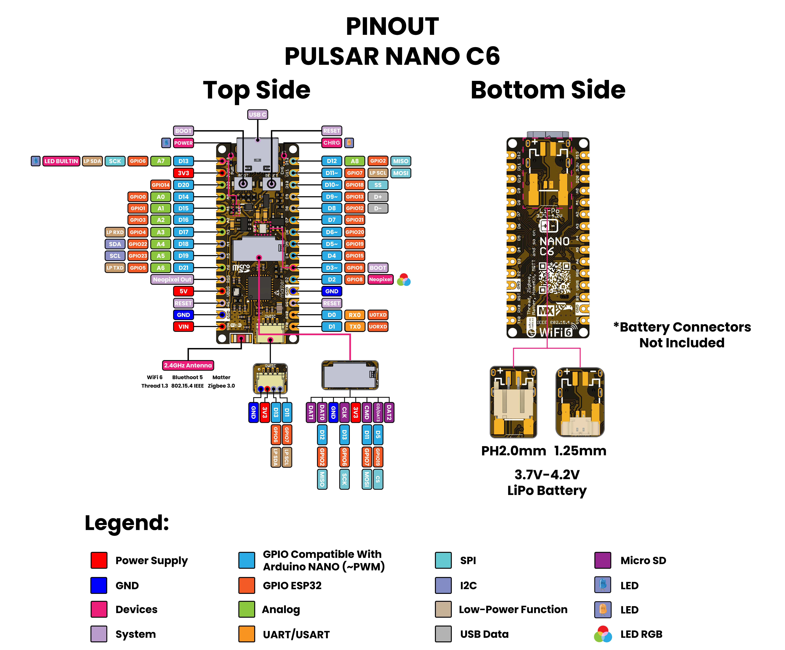

# PULSAR NANO C6 ESP32-C6 Development Board

<a href="https://uelectronics.com"> 
*Click here to purchase one from the UNIT Electronics shop*</a>

For more details, check out the product pages at:
* [UNIT Electronics Website](https://uelectronics.com/)
* [Hardware-PULSAR NANO C6](https://github.com/UNIT-Electronics-MX/UNIT_NANO_ESP32_C6/tree/main/hardware)
* [Product Reference Manual](https://github.com/UNIT-Electronics/UNIT-NANO-C6/blob/main/UNIT-NANO-C6(Product%20Reference%20Manual%20)%5BEN%5D.pdf)
* [PULAR NANO C6 Getting Started Guide](https://unit-electronics-mx.github.io/unit_nano_esp32_c6/)

---

## Description

The **PULSAR NANO ESP32 C6** is a compact and powerful development board featuring the **ESP32-C6** microcontroller. Designed with compatibility in mind, it follows the **Arduino Nano** form factor and pin distribution, making it easy to integrate with existing shields and projects.

Key features include:
- **Wi-Fi 6**, **Bluetooth 5 (LE)**, **Thread**, and **Matter** support.
- Built-in LiPo battery charging circuit.
- MicroSD card socket for external storage.
- QWIIC connector for seamless sensor and module integration.
- Onboard WS2812-2020 Neopixel LED for visual feedback.
- **IEEE 802.15.4 support**, enabling robust low-power wireless communication for **Thread** and **Matter** applications.

---

## Features

- **Microcontroller**:
  - **ESP32-C6**: RISC-V processor, **Wi-Fi 6**, **Bluetooth 5 (LE)**, **Thread**, and **Matter** support, making it perfect for next-generation IoT applications and smart home automation.
  - **IEEE 802.15.4 compliant**, ensuring reliable **Thread** communication and full **Matter** compatibility for seamless integration into smart home ecosystems.

- **USB Connectivity**:
  - USB Type-C interface for power and data.

- **Power Supply**:
  - Integrated LiPo battery charging circuit.
  - Wide input voltage support with onboard regulation.

- **Storage**:
  - MicroSD card slot for external storage.

- **I2C Connectivity**:
  - QWIIC connector for easy expansion with sensors and peripherals.

- **Additional Features**:
  - WS2812-2020 Neopixel LED for visual feedback.
  - Full compatibility with the Arduino Nano form factor and shields.

---

## Applications

The **PULSAR NANO C6** is ideal for:
- **Internet of Things (IoT)**: Wi-Fi 6, Thread, and Bluetooth 5 enable robust connectivity.
- **Smart Home & Automation**: Full **Matter** support ensures seamless interoperability with modern smart home ecosystems.
- **Low-Power Wireless Networks**: **IEEE 802.15.4** support makes it suitable for efficient, low-energy communication in Thread-based IoT applications.
- **Education & Prototyping**: Arduino Nano compatibility ensures easy project integration.
- **Embedded Systems**: Compact size with low-power operation for efficient solutions.
- **Wireless Networking**: Designed for future-proof IoT applications with advanced communication protocols.

---

## Getting Started

The **PULSAR NANO C6** supports:
- **Arduino IDE** with ESP32-C6 board package.
- **MicroPython** and with compatible IDEs like Thonny.

For setup and first projects, refer to the [Getting Started Guide](https://unit-electronics-mx.github.io/unit_nano_esp32_c6/).

---

## Pinout and Schematic

### Pinout Diagram

### Schematic
For detailed circuit design, refer to the [Hardware Documentation](https://github.com/UNIT-Electronics-MX/UNIT_NANO_ESP32_C6/tree/main/hardware) and the full schematic available in the repository.

---

## Development Resources

| Resource                                   | Link                                                                                   |
|-------------------------------------------|----------------------------------------------------------------------------------------|
| **Arduino Package ESP32-C6 JSON**         | [ESP32-C6 Package](https://github.com/UNIT-Electronics/Uelectronics-ESP32-Arduino-Package) |
| **MicroPython Documentation**             | [MicroPython.org](https://micropython.org/)                                            |
| **PULSAR NANO C6 Documentation**            | [PULSAR NANO C6 Documentation](https://github.com/UNIT-Electronics/UNIT-NANO-C6)        |
| **Getting Started with PULSAR NANO C6**     | [PULSAR NANO C6 Guide](https://unit-electronics-mx.github.io/unit_nano_esp32_c6/)      |
| **Thonny IDE**                            | [Thonny.org](https://thonny.org/)                                                     |
| **Arduino IDE**                           | [Arduino IDE](https://www.arduino.cc/en/software)                                     |
| **Visual Studio Code**                    | [Visual Studio Code](https://code.visualstudio.com/download)                          |
| **ESP32-C6 Datasheet**                    | [ESP32-C6 Datasheet](https://www.espressif.com/sites/default/files/documentation/esp32-c6_datasheet_en.pdf) |

---

## Contributions

We welcome contributions! Please review our [Contribution Guidelines](CONTRIBUTING.md) before submitting pull requests.

---

## License

This project is licensed under the [MIT License](LICENSE).

